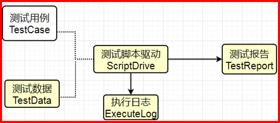

## Auto Test framework v1.0
> API Auto Test framework by using python language + pytest + allure 

English | [简体中文](./README.md)

- A Simple architecture diagram




## function realized
- Interface data dependency: interface B can use a field in interface a's response as a parameter
- Dynamic multiple assertions: multiple assertions that dynamically extract the actual expected results and compare them with the specified expected results
- Generate an allure style report when the test has complete.
## dependency
```
allure-pytest==2.8.17		
jsonpath==0.82				
loguru==0.5.1				
pytest==6.0.1				
PyYAML==5.3.1				
requests==2.24.0			
xlrd==1.2.0					
xlwt==1.3.0                 
```
## directory structure
```shell
├─api
│  └─client.py	# request function
├─config
│  └─config.yaml	# the config
├─data
│  └─APITestCase.xlsx	# the case file
├─log
│  └─YYYY-MM-DD.log	# the log file, end-with YYYY-MM-DD.log
├─report
│  ├─data           # allure test report data
│  └─html			# allure test report
├─test
│  ├─conftest.py	# initial test object 
│  └─test_api.py	# test api
├─tools		            
│  ├─__init__.py		# the common test function
│  ├─data_process.py	# the data process
├─requirements.txt		 # dependency file
└─main.py	# the main file to start the project
```

## how to start
1. install the dependecy by using pip install -r requirements.txt
```shell
注：If the target server to be migrated cannot be networked, you can download the dependent packages to the packages/ folder of the current directory by using the command of pip download -d packages/ -r requirements.txt , and then the target server can use the command of pip install --no-index --find-links=packages/ -r requirements.txt to offline install dependent package
```
2. write the case
```shell
注： the test case is excle, and you should follow the rule in the excle comment to write the case 
```
3. start test by the command python main.py
4. see the report and result

## how to do CICD with Jenkins

https://www.cnblogs.com/zy7y/p/13448102.html

